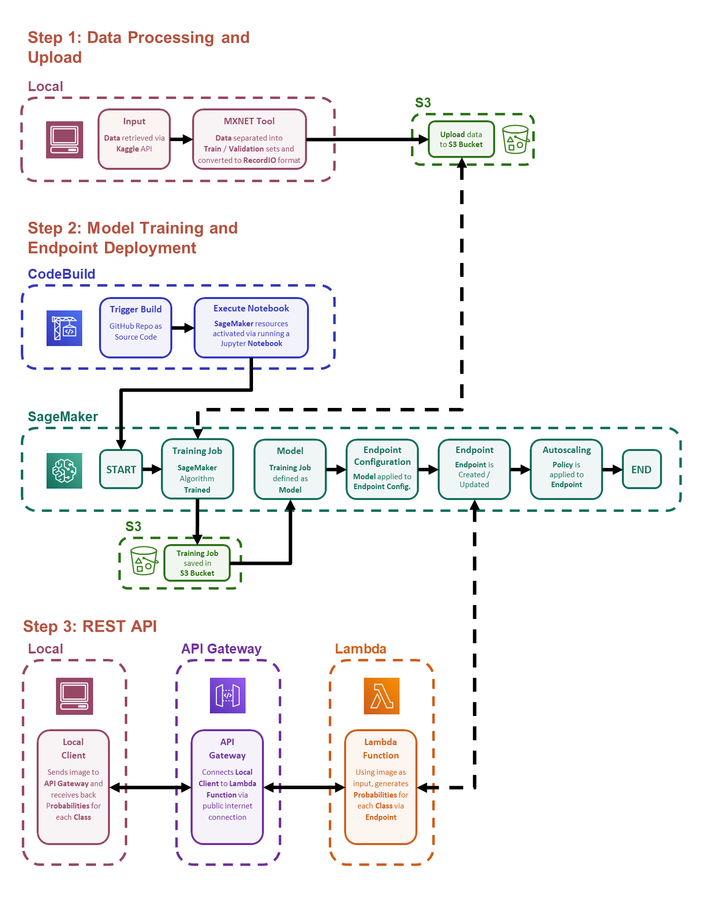

*Add Distracted Driver Image as Header*

# Continuous Integration and Deployment of Image Classification Model with Amazon Sagemaker
## DSBA 6190 - Intro to Cloud Computing - Team Project

**Team Members**
* Evan Canfield
* Roma Dutta
* Shilpa Patil
* Ibrokhim Sadikov

This repo contains the files for a Continuous Integration/Continuous Deployment (CI/CD) process for an image classification model to identify distracted drivers. For the process framework, this project uses Amazon CodeBuild to continuously deploy and update the project, and Amazon Sagemaker to train and deploy the resulting model to an endpoint. The endpooint is then made publicaly avaiable as a REST API by using Amazon Gateway API coupled with Amazon Lambda.

The project flow is broken down into the following steps:

## Process Input Data and Upload to AWS S3
### Data Description
The input data for the model is provided by the [**State Farm Distracted Driver Detection**](https://www.kaggle.com/c/state-farm-distracted-driver-detection) Kaggle competition. The data contains two image directories labeled **train** and **test**, as well as two CSV files. The **train** directory contains 24,424 images broken up into 10 discrete classes. Each class of image is located in a sub-folder of the **train** directory. The ten classes are:

* **c0**: safe driving
* **c1**: texting - right
* **c2**: talking on the phone - right
* **c3**: texting - left
* **c4**: talking on the phone - left
* **c5**: operating the radio
* **c6**: drinking
* **c7**: reaching behind
* **c8**: hair and makeup
* **c9**: talking to passenger

The **test** directory contains 79,726 unlabeled images.

The two CSV files are as follows:

* sample_submission.csv - a sample submission file in the correct format
* driver_imgs_list.csv - a list of training images, their subject (driver) id, and class id

### Data Processing and Upload to S3
The processing of the data and upload to S3 is performed in the **processing_upload2s3.ipynb** notebook, located in the **notebooks** folder.

**Note**: *Currently all data processing is performed locally, and must be completed manually before loading into the CI/CD framework. Future plans are to integrate this step into fully into the process.*

The images provided in the **train** directory are JPG files. The algorithm used to develop the model is the Amazon Sagemaker Image Classification algorithm. This algorithm can take input data in two formats: 

1. Raw image files (i.e.: JPG, PNG, etc.)
2. RecordIO - [Apache MXNet file type](https://mxnet.apache.org/api/faq/recordio)

The RecordIO file type is recommended by Amazon and is the file type used for this project. Therefore, the raw image files provided needed to be converted to RecordIO. To convert these raw images, the conversion tool (**im2rec.py** python script, found in the **tools** folder) provided by [Apache MXNet](https://mxnet.apache.org/api/faq/recordio) was used.

## Train and Deploy Model
Once the data is processed and uploaded to S3, the model can be trained. All model training and deployment is performed in the **model_deploy-distracted driver_identification.ipynb** notebook. This notebook imports the data from S3 (uploaded in the previous step), trains the Image Classification Model (using a pre-trained model to save time and money), and then deploys the model to an HTTPS endpoint. Once the endpoint is deployed, an autoscaling policy is applied.

## REST API
A REST API is established to allow public access to the deployed model. The REST API uses Amazon Gateway API Service with a Lambda Function to generate predications using an image as an input. The Lambda function script can be found in the **REST API** directory. Furthermore, the README in the  **REST API** directory provides instructions on how to establish an API Gateway which will accept JPG images. 

## Load-Test Deployed Endpoint
The deployed endpoint was load tested using [Locust](https://locust.io/). All load testing files and and results discussion can be found in the **load_test** directory.

## Overall Structure: CodeBuild Framework For Continuous Deployment
To Continuously Deploy the Image Classification model, this project uses Amazon CodeBuild. CodeBuild automatically compiles the source code and runs the necessary files in this repo to train and deploy the model. Once trained, the model is either deployed as an endpoint, or a currently deployed endpoint is updated with the new model.

The CodeBuild process is defined by the **buildspec.yml** file. This file tells CodeBuild the steps for this project once triggered. Currently, the CodeBuild set to be triggered by an update to this GitHub repo (this function is currently off during development). In the future, additional lambdas might be used for additional triggers (such as a trigger when new data is added to the training data). The following is the process flow:

GitHub Repo Updates > Triggers CodeBuild > CodeBuild Executes **buildspec.yml** > Executes **model_deploy-distracted driver_identification.ipynb** notebook

# Possible Future Updates
* Integrate input date processing as part of the automatic deployment.
* Testing and reports as part of the CodeBuild flow after the model is deployed.
