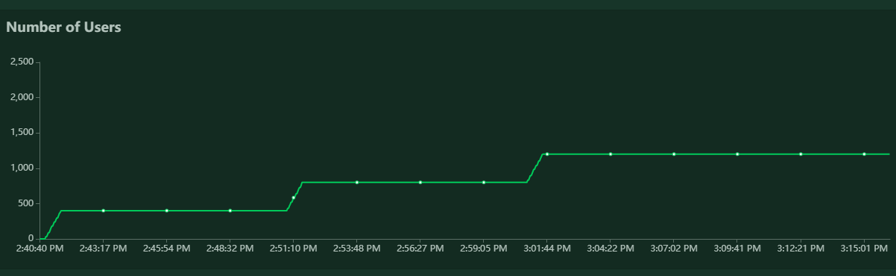
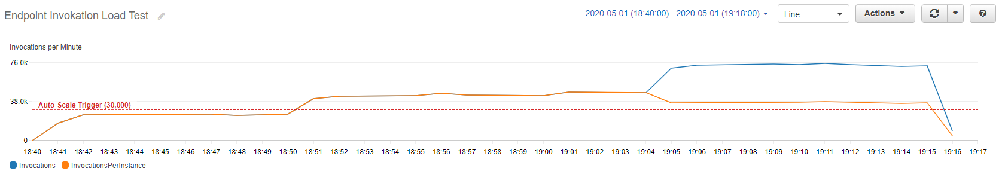
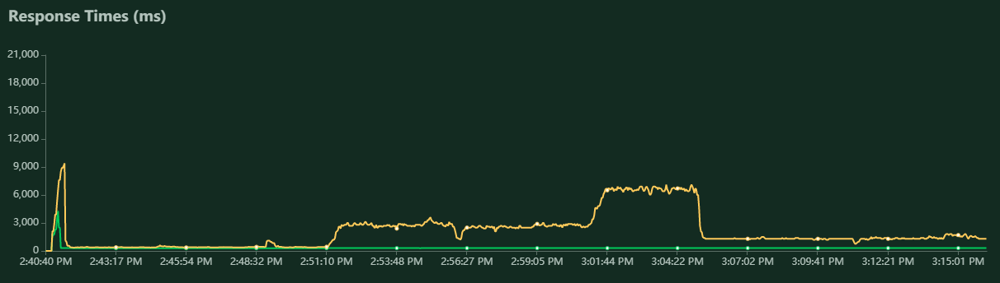
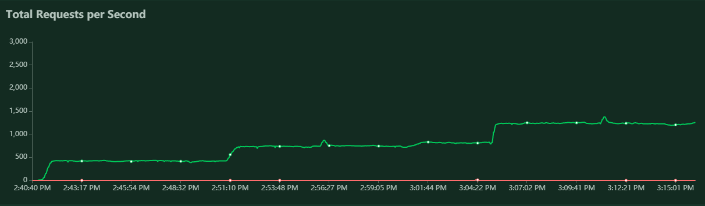

# Load Testing 

Load testing was performed using the [Locust](https://locust.io/) open source load testing tool.  The load test was performed by using Locust to swarm the REST API. Every successful POST to the REST API would also use the deployed model endpoint to generate a prediction. Therefore, swarming the REST API would directly increase the invokation load on the endpoint. At default state for the endpoint is one instance. Once the number of invokations on an instance reached a pre-defined level (in the Auto-Scaling Policy), the endpoint would automatically generate additinonal instances, to handle the increased load. This test was to ensure that this scale-up would automatically occur.

In order to reach the Requests per Second (RPS) needed for this project one standard machine would not be sufficient. The Locust tool has distributed load testing capabilites, so the load test for this prohect was run using two Amazon Cloud 9 instances. One instance acted as the Master node, the other instance the Slave node. The Slave node instance used a **m4.2xlarge** instance,  which has 8 CPUs. All 8 CPUS werere used as a Slave nodes, yielding 8 load testing actors. 

The load test proceeded as a step function. The maximum number of users modeled was 1,200. To reach a max level of 1,200 users, every 10 minutes the test would increase by 400 users, as seed in the plot beloq. Each user pinged the REST API every 0.1 to 0.5 seconds.

## Number of Users

The following plot shows is from AWS CloudWatch metrics for the endpoint being tested. It shows the number of total invocations, and the number of invocations per instance. Also, the automatic trigger level (30,000 invokations per minute) is shown. 

## Invocations

What we clearly see is that around 18:50 UTC, the invocations per minute increases and crosses the 30,000 threshold which triggers the creation of an additional instance. This increase conincides with the step increase of users, from 400 - 800. Approximately 14 minutes later, the second instance comes into service, as the total invocations per minute increases (blue) but the invocations per instance decreases (orange).  

Locust also provides metrics in chart form. Locust monitors the API response time and the effective RPS. Below is the response time plot. The green line is the median response time. The orange line is the 95% max respoinse time. Additionally, the RPS plot is shown.

**Note:** *Locust plots list the time in the time zone of the machine running the test (EDT). AWS Cloudwatch uses UTC. All charts shown are of the same test.

## Response Time

## Request per Second

With this  reponse time plot, we can directly see the effect of the endpoint autoscaling from one instance to two. Outside of quick spike at the very beginning, the median and 95% max reponse times are in-line. At 2:51, the load test ramps up from 400 - 800 users (and from ~ 400 RPS to 800 RPS). 

At this new load, a single instance is no longer enough to smoothly handle it. The endpoint automatically updates (crosses 30,000 invocations per minute as shown above) to increase the number of instances from one to two. It takes just over 10 minutes for a new instance to spin up and reach an **In Service** state. That state is reached right around 3:05. Now, the instance is receiving pings from 1200 users, at rate just above 800 RPS. The 95% max response time has increased accordingly. But once the second endpoint comes one line the 95% max response time plummets, and remains steady. The two instances can handle the load much better. 

At the time the test ended the endpoint was in the process of adding a third instance, as the 1200 users generated more than 60,000 invocations per minute. While it would have been interesting to see the effects of the third instance, pricing concerns in AWS called for the ending the test once the endpoint was shown to correctly auto-scale.
